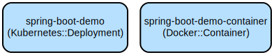

# Spring Boot Demo: A RESTful Web Service with Docker and Kubernetes Support

This project demonstrates a Spring Boot application that provides RESTful endpoints with Docker containerization and Kubernetes deployment support. It showcases modern Java development practices with comprehensive testing and cloud-native deployment capabilities.

The application implements a simple greeting service with health monitoring through Spring Actuator. It is built using Java 24 and Spring Boot 3.5.0, providing a foundation for building production-ready services. The project includes Docker containerization using Amazon Corretto JDK and Kubernetes deployment configurations, making it suitable for cloud deployments.

## Repository Structure
```
spring-boot-demo/
├── src/                           # Source code directory
│   ├── main/java                  # Application source code
│   │   └── org/example/springbootdemo
│   │       ├── Greeting.java              # Data model for greeting response
│   │       ├── GreetingController.java    # REST controller for greeting endpoint
│   │       ├── HelloController.java       # REST controller for hello endpoints
│   │       └── SpringBootDemoApplication.java # Application entry point
│   └── test/                     # Test source code
├── gradle/                       # Gradle wrapper configuration
├── deployment.yaml              # Kubernetes deployment configuration
├── Dockerfile                   # Docker image configuration
├── build.gradle                 # Gradle build configuration
└── buildspec.yml               # AWS CodeBuild configuration
```

## Usage Instructions
### Prerequisites
- Java Development Kit (JDK) 24
- Gradle 8.x (included via wrapper)
- Docker (for containerization)
- Kubernetes cluster (for deployment)

### Installation

1. Clone the repository:
```bash
git clone https://github.com/bcguo/spring-boot-demo.git
cd spring-boot-demo
```

2. Build the application:
```bash
# For Unix-like systems
./gradlew build

# For Windows
gradlew.bat build
```

3. Build Docker image:
```bash
./gradlew bootBuildImage
```

### Quick Start
1. Run the application locally:
```bash
./gradlew bootRun
```

2. Test the endpoints:
```bash
# Get default greeting
curl http://localhost:8080/

# Get personalized greeting
curl http://localhost:8080/hello?name=YourName

# Get JSON greeting
curl http://localhost:8080/greeting?name=YourName
```

### More Detailed Examples
1. Using the root endpoint:
```bash
curl http://localhost:8080/
# Response: "Greetings from Spring Boot!"
```

2. Using the hello endpoint with custom name:
```bash
curl http://localhost:8080/hello?name=John
# Response: "Hello, John!"
```

3. Using the hello endpoint with default value:
```bash
curl http://localhost:8080/hello
# Response: "Hello, World!"
```

4. Using the greeting endpoint for JSON response:
```bash
curl http://localhost:8080/greeting?name=John
# Response: {"id":1,"content":"Hello, John!"}
```

5. Docker deployment:
```bash
docker run -p 8080:8080 bcguo/spring-boot-demo:latest
```

### Running on Local Minikube Kubernetes Cluster
1. Build the image
```bash
docker build -t spring-boot-demo .
```

2. Load the image into Minikube
```bash
docker save spring-boot-demo > spring-boot-demo.tar
minikube start
minikube image load spring-boot-demo.tar
# minikube image ls
# ...
# localhost/spring-boot-demo:local
```

3. Create the deployment
```bash
kubectl apply -f deployment.yaml
# deployment.apps/spring-boot-demo created
```

4. Retrieve the Minikube tunnel URL for testing
```bash
minikube service spring-boot-demo --url
```

### Troubleshooting

1. Application fails to start
- Check if port 8080 is already in use
```bash
# On Unix-like systems
lsof -i :8080
# On Windows
netstat -ano | findstr :8080
```
- Verify Java version:
```bash
java -version
```
- Enable debug logging by adding to application.properties:
```properties
logging.level.org.springframework=DEBUG
```

2. Build failures
- Clear Gradle cache:
```bash
./gradlew clean --refresh-dependencies
```
- Verify Gradle wrapper:
```bash
./gradlew wrapper --gradle-version 8.5
```

3. Docker image build fails
- Ensure Docker daemon is running
- Check Docker build logs: `docker build -t spring-boot-demo .`
- Verify Dockerfile paths are correct

4. Kubernetes deployment issues
- Verify cluster connection: `kubectl cluster-info`
- Check pod status: `kubectl get pods`
- View pod logs: `kubectl logs deployment/spring-boot-demo`

## Data Flow
The application processes HTTP requests through a simple request-response flow, implementing RESTful endpoints for greeting services.

```ascii
Client Request -> Spring Boot Controller -> Response Generation -> Client Response
     |                    |                        |                    |
   HTTP               Routing &              Data Processing        JSON Response
  Request          Authentication           & State Management        Generation
```

Component interactions:
1. Client sends HTTP request to endpoints (/, /hello, or /greeting)
2. Spring Boot routes request to appropriate controller
3. Controller processes request parameters
4. Response is generated with appropriate content type
5. Spring Boot serializes response to JSON
6. Response is sent back to client

## Infrastructure


The application is containerized and deployed using the following resources:

Docker:
- Base Image: amazoncorretto:24-alpine-jdk
- Exposed Port: 8080
- Security: Runs as non-root user 'spring'

Kubernetes:
- Deployment: spring-boot-demo
- Replicas: 1
- Container Image: localhost/bcguo/spring-boot-demo:latest
- Pull Policy: Never

AWS CodeBuild:
- Runtime: Java Corretto 24
- Build Steps: Gradle build and Docker image creation
- Artifact: Docker image pushed to ECR